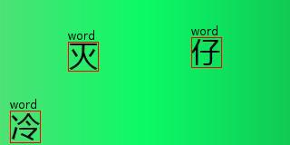
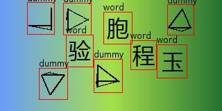
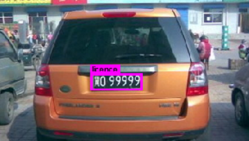
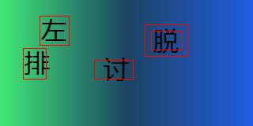
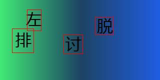
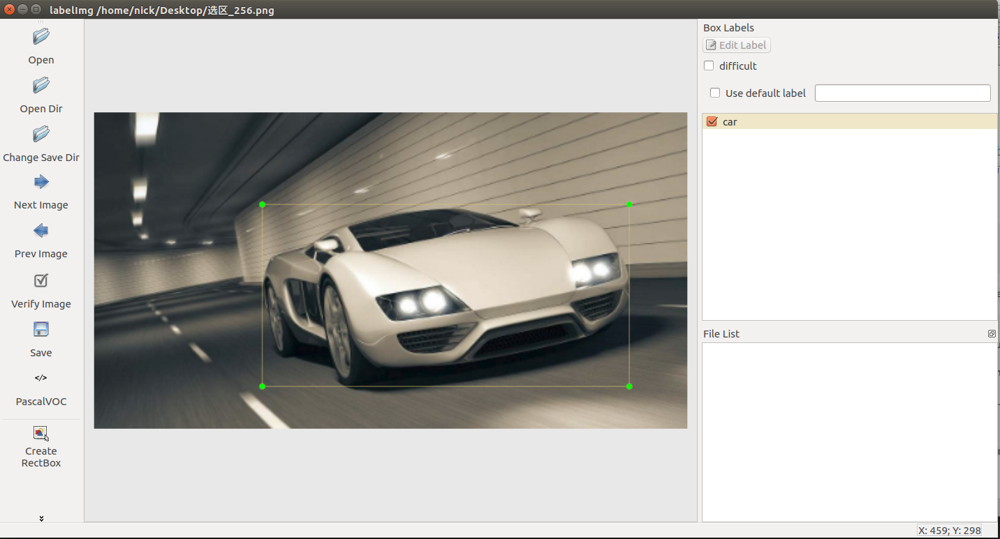
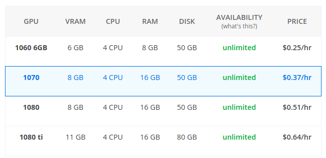

# darknet_captcha
项目基于darknet开发了一系列的快速启动脚本，旨在让图像识别新手或者开发人员能够快速的启动一个目标检测（定位）的项目。
本项目分为两个部分：
1. 提供两个目标检测（单分类和多分类）的例子，你可以通过例子熟悉定位yolo3定位网络的使用方式
2. 基于darknet提供一系列API，用于使用自己的数据进行目标检测模型的训练

  


# 目录
* [项目结构](#项目结构)
* [开始一个例子：单类型目标检测](#开始一个例子：单类型目标检测)
* [第二个例子：多类型目标检测](#第二个例子：多类型目标检测)
* [训练自己的数据](#训练自己的数据)
* [API文档](#API文档)
* [其他问题](#其他问题)  
  * [使用阿里云OSS加速下载](#使用阿里云OSS加速下载)  
  * [GPU云推荐](#GPU云推荐)  
  * [CPU和GPU识别速度对比](#CPU和GPU识别速度对比)  
* [报错解决办法](#报错解决办法)
* [TODO](#TODO)

# 项目结构
项目分为`darknet、extent、app`三部分  
1. darknet: 这部分是[darknet](https://github.com/pjreddie/darknet)项目源码，没有作任何改动。
2. extent: 扩展部分，包含**生成配置**、**生成样本**、**训练**、**识别demo**、**api程序**。
3. app: 每一个新的识别需求都以app区分，其中包含配置文件、样本和标签文件等。

# 开始一个例子：单类型目标检测
darknet实际上给我们提供了一系列的深度学习算法，我们要做的就是使用比较简单的步骤来调用darknet训练我们的识别模型。  
- 推荐使用的操作系统是`ubuntu`，遇到的坑会少很多。  
- 如果使用windowns系统，需要先安装`cygwin`，便于编译darknet。（参考我的博客：[安装cygwin](https://blog.csdn.net/weixin_39198406/article/details/83020632)）  

下面的步骤都已经通过`ubuntu16.04`测试。  
#### 1.下载项目
```
git clone https://github.com/nickliqian/darknet_captcha.git
```
#### 2.编译darknet
进入`darknet_captcha`目录，下载`darknet`项目，覆盖`darknet`目录：  
```
cd darknet_captcha
git clone https://github.com/pjreddie/darknet.git
```
进入`darknet`目录，修改`darknet/Makefile`配置文件  
```
cd darknet
vim Makefile
```
- 如果使用GPU训练则下面的GPU=1  
- 使用CPU训练则下面的GPU=0  
```
GPU=1
CUDNN=0
OPENCV=0
OPENMP=0
DEBUG=0
```
然后使用`make`编译`darknet`：  
```
make
```
>不建议使用CPU进行训练，因为使用CPU不管是训练还是预测，耗时都非常久。  
>如果你需要租用临时且价格低的GPU主机进行测试，后面介绍了一些推荐的GPU云服务。  
>如果在编译过程中会出错，可以在darknet的issue找一下解决办法，也可以发邮件找我要旧版本的darknet。

#### 3.安装python3环境
使用pip执行下面的语句，并确保你的系统上已经安装了tk：  
```
pip install -r requirement.txt
sudo apt-get install python3-tk
```

#### 4.创建一个应用
进入根目录，运行下面的程序生成一个应用的基本配置：  
```
cd darknet_captcha
python3 extend/generate_config_file.py my_captcha 1
```
这里的类别默认生成`classes_1`，你可以修改类别名称；  
打开`app/my_captcha/my_captcha.names`修改`classes_1`为主机想要的名称即可。

如何查看`generate_config_file.py`的命令行参数解释？  
直接运行`python generate_config_file.py`便可以在控制台查看，下面的程序也是如此。  

>如果你对darknet相关配置有一定的了解，可以直接打开文件修改参数的值，这里我们保持原样即可。  

#### 5.生成样本
生成样本使用另外一个项目 [nickliqian/generate_click_captcha](https://github.com/nickliqian/generate_click_captcha)  
这里我已经集成进去了，执行下面的命令生成样本和对应标签到指定应用中`yolo`规定的目录：  
```
python3 extend/generate_click_captcha.py my_captcha
```
运行`python generate_click_captcha.py`查看参数解释。

#### 6.划分训练集和验证集
运行下面的程序，划分训练集和验证集，同时将标签的值转换为`yolo`认识的格式：  
```
python3 extend/output_label.py my_captcha 1
```
这里填写的种类需要与上面一致。
运行`python output_label.py`查看参数解释。

#### 7.开始训练
到这里，我们要准备的东西还差一样，我们需要下载darknet提供的预训练模型放在`darknet_captcha`目录下：  
```
wget https://pjreddie.com/media/files/darknet53.conv.74
```
在`darknet_captcha`目录下，执行下面的命令开始训练：  
```
./darknet/darknet detector train app/my_captcha/my_captcha.data app/my_captcha/my_captcha_train.yolov3.cfg darknet53.conv.74
```
训练过程中模型会每一百次迭代储存一次，储存在`app/my_captcha/backup/`下，可以进行查看。  

#### 8.识别效果
使用`GTX 1060`训练大概1.5小时，训练迭代到1000次，会有比较明显的效果。  

  
我们找一张验证集的图片使用不同进度下的模型进行识别测试，执行下面的语句开始识别：  
```
python3 extend/rec.py my_captcha 100
```
这里的100是选择`app/my_captcha/images_data/JPEGImages`目录下的第一百张图片进行识别。  
运行`python rec.py`查看参数解释。  
  
迭代300次：
  
迭代800次：
  
迭代1000次：
  
迭代1200次：
  


## 第二个例子：多类型目标检测
步骤和上面基本上一致，直接把命令列出来：
```
# 生成配置文件
python3 extend/generate_config_file.py dummy_captcha 2
# 生成图片
python3 extend/generate_click_captcha.py dummy_captcha 500 True
# 输出标签到txt
python3 extend/output_label.py dummy_captcha 2
# 开始训练w
./darknet/darknet detector train app/dummy_captcha/dummy_captcha.data app/dummy_captcha/dummy_captcha_train.yolov3.cfg darknet53.conv.74
# 识别测试
python3 extend/rec.py dummy_captcha 100
```

## 训练自己的数据
下面的过程教你如何训练自己数据。  
假定我们要创建一个识别路上的车和人的应用，因此类别数量为2。  
假定你现在有一些原始图片，首先你需要给这些图片打上标签，推荐使用[labelImg](https://github.com/tzutalin/labelImg)进行打标工作。  
使用教程可以自行谷歌，软件界面大致如下：
  

给图片中的人和车分别打上person和car的标签，会生成xml标签文件。  
接下来，我们创建一个应用，应用名称是`car`，类别为`2`类，同时生成一些配置文件：
```
python3 extend/generate_config_file.py car 2
```
然后把你的原始图片放到指定的路径`app/car/JPEGImages`，把xml标签文件放在`app/car/Annotations`  
yolo训练的时候需要图片中目标的相对坐标，所以这里需要把xml的坐标计算为相对坐标的形式。  
同时car.data中需要分别定义训练集和验证集的样本路径，这里会划分出训练集和验证集，同时生成两个txt文件记录其路径。  
```
python3 extend/output_label.py car 2
```
要提到的是，这里可以打开car.names，把里面的class_1和class_2分别修改为car和person，这里识别结果就会输出car和person。
然后就可以开始训练了：
```
./darknet/darknet detector train app/car/car.data app/car/car_train.yolov3.cfg darknet53.conv.74
```
识别测试和上面也没有上面区别：
```
# 识别测试
python3 extend/rec.py car 100
```

## API文档
暂缺

## 其他问题
### 使用阿里云OSS加速下载
如果你使用国外云主机进行训练，训练好的模型的下载速度确实是一个问题。  
这里推荐使用阿里云oss，在云主机上把文件上传上去，然后使用oss下载下来。  
配置秘钥：  
```
# 从环境变量获取密钥
AccessKeyId = os.getenv("AccessKeyId")
AccessKeySecret = os.getenv("AccessKeySecret")
BucketName = os.getenv("BucketName")
```
上传图片：  
```
python3 extend/upload2oss.py app/my_captcha/images_data/JPEGImages/1_15463317590530567.jpg
python3 extend/upload2oss.py text.jpg
```

### GPU云推荐
使用租用 vectordash GPU云主机，ssh连接集成了Nvidia深度学习环境的ubuntu16.04系统  
包含以下工具或框架：  
```
CUDA 9.0, cuDNN, Tensorflow, PyTorch, Caffe, Keras
```  
vectordash提供了一个客户端，具备远程连接、上传和下载文件、管理多个云主机等。    
下面是几种显卡的租用价格：  
  
创建实例后，面板会提供一个秘钥，输入秘钥后，就可以使用客户端操作了：  
```
# 安装客户端
pip install vectordash --upgrade
# 登录
vectordash login
# 列出主机
vectordash list
# ssh登录
vectordash ssh <instance_id>
# 打开jupyter
vectordash jupyter <instance_id>
# 上传文件
vectordash push <instance_id> <from_path> <to_path>
# 下载文件
vectordash pull <instance_id> <from_path> <to_path>
```
由于vectordash主机在国外，所以上传和下载都很慢，建议临时租用一台阿里云竞价突发型实例（约7分钱一小时）作为中转使用。  

### CPU和GPU识别速度对比
GTX 1060, 识别耗时1s
```
[load model] speed time: 4.691879987716675s
[detect image - i] speed time: 1.002530813217163s
```
CPU, 识别耗时13s
```
[load model] speed time: 3.313053846359253s
[detect image - i] speed time: 13.256595849990845s
```

## 报错解决办法
1. UnicodeEncodeError: 'ascii' codec can't encode character '\U0001f621' in posit  
[参考链接](https://blog.csdn.net/u011415481/article/details/80794567)  
2. pip install, locale.Error: unsupported locale setting  
[参考链接](https://blog.csdn.net/qq_33232071/article/details/51108062)  

## TODO
1. 支持多类别检测的识别和训练 **Done**
2. WebServer API调用
3. 分类器

